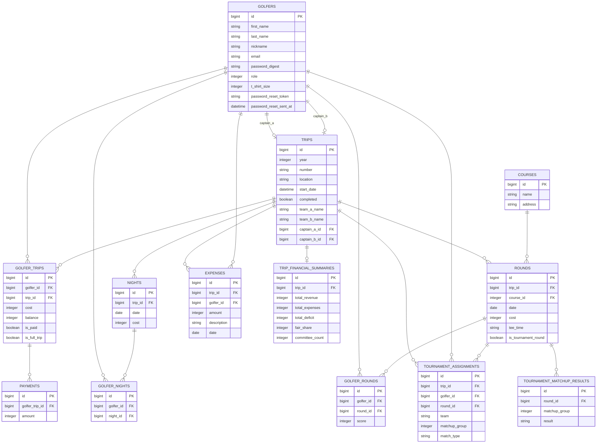

# KPC — Golf Trip Management App

Full-stack Ruby on Rails 5.2.8 web application for managing an annual group golf trip. Members register for the trip, select which nights and rounds they'll attend, and track payments. Admins manage trip logistics, record payments, and monitor trip finances in real time. A built-in tournament system handles end-of-trip team generation, matchup pairings, score tracking, and standings.

---

## Features

### For Golfers
- **Registration & Authentication** — Account creation with invite token, secure login/logout, and password reset via tokenized email link
- **Trip Registration** — Select individual nights and golf rounds, or register for the full trip (which applies a first-night discount)
- **Personal Dashboard** — View trip itinerary, cost breakdown, payment history, and outstanding balance
- **Profile Management** — Update name, email, password, and t-shirt size

### For Admins
- **Finances Page** — Live view of every golfer's cost, net paid, outstanding balance, and paid status across the trip
- **Payment Recording** — Log payments as they arrive, mark golfers as fully paid in one step, or record partial payments
- **Return Processing** — Issue refunds when a golfer's cost is reduced after they've already paid; overpayment is flagged with a warning before processing
- **Golfer Trip Editing** — Modify which nights and rounds a golfer is attending after registration; cost and balance recalculate automatically
- **Expense Tracking** — Log and manage trip expenses
- **Admin Trip Registration** — Admins register for trips like any other golfer (selecting nights and rounds), but their cost and balance are always forced to $0 and marked paid immediately; admin registrations are excluded from the finances paid/unpaid display and do not trigger a signup confirmation email
- **Attendance Calendar** — Visual grid of all registered golfers (including admins) showing which nights and rounds each person is attending
- **Course Management** — Maintain a database of golf courses with address information
- **Trip Announcements** — Send announcements to all registered golfers via email
- **Previous Trips** — Historical archive of past trips with attendance and financial records
- **Trip Finalization** — Lock in a trip financial summary snapshot (site admin only)

### Tournament
- **Score Entry** — Admins enter each golfer's stroke total for non-tournament rounds; these scores drive the ranking algorithm
- **Player Rankings** — Golfers are ranked by average score across non-tournament rounds, with automatic fallback to the most recent prior trip for golfers who lack current-trip scores
- **Captain Selection** — Two team captains are designated before team generation; their nicknames automatically set the team names (e.g., "Team Tony" / "Team Artie"); captains are guaranteed to end up on opposite teams regardless of where the ranking algorithm places them
- **Team Generation** — A serpentine algorithm assigns golfers to Team A and Team B using rank-balanced groups of four, producing equal rank sums within every foursome
- **Per-Round Pairings** — Matchup groups are generated independently for each tournament round; individual assignments can be overridden or an entire round's pairings can be redrawn
- **Result Tracking** — Admins record the outcome of each matchup group (Team A wins / Tie / Team B wins); team standings aggregate automatically
- **Live Standings** — Running point totals and a winner banner update as results are entered

### Automated Workflows
- **Pre-trip reminder emails** — A GitHub Actions scheduled job runs daily starting in the weeks before the trip and sends reminder emails to golfers with outstanding balances; the workflow self-disables after March 1
- **Transactional emails** — Trip signup confirmation, payment received, and balance paid emails fire automatically on the corresponding events; trip signup emails are suppressed for admin golfers

---

## Tech Stack

| Layer | Technology |
|---|---|
| Framework | Ruby on Rails 5.2.8 |
| Language | Ruby 2.7.4 |
| Database | PostgreSQL |
| Frontend | Bootstrap 5.1.3, jQuery 3.6.0, Turbolinks 5, SCSS |
| Authentication | bcrypt (`has_secure_password`), custom session management |
| Authorization | Role-based (`default` / `admin`), site admin via env var |
| Email | ActionMailer + LetterOpener (development) |
| Rate Limiting | Rack::Attack |
| Environment Config | Figaro |
| Markdown Rendering | Redcarpet |
| Testing | RSpec, Shoulda-Matchers, SimpleCov |
| Containerization | Docker |
| Hosting | Fly.io |
| CI/CD | GitHub Actions |

---

## Database Schema



### Key Models

| Model | Description |
|---|---|
| `Golfer` | User accounts with roles (`default`, `admin`) |
| `Trip` | A single annual golf trip with year, number, location, dates, and optional team captain references |
| `Night` | An individual night of accommodation on a trip, with a per-night cost |
| `Round` | An individual golf round on a trip; flagged as a tournament round or a scoring round |
| `GolferTrip` | Join table recording a golfer's registration for a trip; holds `cost`, `balance`, `is_paid`, and `is_full_trip` |
| `GolferNight` | Records which nights a golfer is attending |
| `GolferRound` | Records which rounds a golfer is playing; holds an optional `score` used for tournament ranking |
| `Payment` | A payment or return for a golfer trip; negative `amount` values represent returns |
| `Expense` | A trip expense attributed to a golfer |
| `Course` | A golf course with address info |
| `TripFinancialSummary` | A finalized financial snapshot of a completed trip |
| `TournamentAssignment` | Records a golfer's team, matchup group, and match type for a specific trip and round; contains the full team-generation algorithm |
| `TournamentMatchupResult` | Records the outcome of a matchup group for a round (`A`, `B`, or `tie`); aggregates team point totals |

---

## Architecture Highlights

### Financial Logic

The core financial invariant is:

```
balance = max(cost - payments.sum(:amount), 0)
```

Every code path that writes to `balance` recomputes it from a fresh `payments.sum` rather than from the cached `balance` value, preventing drift. Returns are modeled as `Payment` records with a negative `amount` — no separate table.

The payment system handles five distinct flows: registration, adding a payment, marking as paid in one step, admin editing of nights/rounds (with overpayment detection and confirmation), and processing returns. See [`FINANCIAL_LOGIC.md`](FINANCIAL_LOGIC.md) for a complete walkthrough.

### Trip Cost Calculation

A golfer's cost is computed from the nights and rounds they selected:

- **Gross cost** = sum of selected night costs + sum of selected round costs
- **Full trip discount** — if the golfer attends every night and every round, the first night is free
- `is_full_trip` is detected automatically during registration by comparing selected counts against total trip counts, or via an explicit "whole enchilada" registration option

### Role-Based Authorization

Two authorization levels are enforced via before-action filters throughout the controllers:

- **`require_admin`** — any golfer with `role: :admin`; gates payment recording, the finances page, and attendance views
- **`require_site_admin`** — a single designated golfer identified by matching `SITE_ADMIN_EMAIL`; gates return processing, golfer trip editing, and trip finalization

### Password Reset Security

Reset tokens are generated with `SecureRandom.urlsafe_base64`, immediately hashed with SHA256 before being stored in the database, and expire after 2 hours. The raw token is sent in the email link; the hashed version is what's stored — the database never holds a redeemable token.

### Tournament Team Generation Algorithm

Golfers are ranked by average stroke score across non-tournament rounds (lower = better). Golfers with no current-trip scores fall back to their average from the most recent prior trip; golfers with no history at all sort last.

Ranked players are decomposed into groups:
- **Groups of 4** fill the bulk of the field
- A remainder of 3 becomes a single triple (2v1 match)
- A remainder of 2 becomes a single pair (1v1 match)
- A remainder of 1 produces one triple and one pair

Within each group of 4, Team A receives positions 0 and 3 (best + worst) and Team B receives positions 1 and 2 (the two middle players). This guarantees equal rank sums for every complete foursome.

**Captain placement** is enforced after the serpentine pass: the two designated captains are always placed on opposite teams. If the algorithm produces the wrong arrangement, the minimum necessary swap is made — preferring to swap within the same matchup group before reaching across groups.

### Dashboard States by Role

The dashboard (`/dashboard`) derives its state from two independent signals: `Trip.current` (driven by the `CURRENT_TRIP_NUMBER` env var) and the trip's `completed` boolean. These combine differently depending on the user's role.

**Admins**

| Condition | Trip card (Attendance / Finances / Edit) | Global tools card |
|---|---|---|
| `Trip.current` exists, not completed, admin registered | Shown | Always shown |
| `Trip.current` exists, not completed, admin not registered | Shown — includes "Register for KPC X" button | Always shown |
| `Trip.current` exists, completed | Hidden | Always shown |
| No current trip (`CURRENT_TRIP_NUMBER` unset or unmatched) | Hidden | Always shown |

Score entry buttons (for non-tournament rounds) appear in the global tools card whenever `Trip.current` exists, regardless of whether the trip is completed.

Site-admin-only buttons — Broadcast, Courses, Create Trip — are nested inside the global tools card and only render when `current_user.email == SITE_ADMIN_EMAIL`.

**Default (non-admin) golfers**

The non-admin branch ignores the `completed` flag entirely and uses calendar date to determine whether the trip is "over":

| Condition | Dashboard shows |
|---|---|
| No current trip | "Stay tuned for KPC [next number]" (predicted from last completed trip) |
| Current trip exists, last night has passed (`last_night.date < Date.today`) | "Stay tuned for KPC [next number]" (regardless of `completed` flag) |
| Current trip ongoing, golfer is registered | Full trip card: itinerary calendar, golf schedule, balance, payment instructions |
| Current trip ongoing, golfer not yet registered | "Sign up for KPC X" button |

**Completed vs. finalized**

These are two distinct states:

- **Completed** (`trips.completed = true`) — set by the site admin via the "Complete Trip" button. Hides the trip-specific admin card and moves the trip onto the Previous Trips page.
- **Finalized** — a `TripFinancialSummary` record exists for the trip. Created separately after completion. The Previous Trips page shows the full financial table (revenue, expenses, deficit, committee fair share) for finalized trips; trips that are completed but not yet finalized show "No financial summary recorded."

The Previous Trips page (`/previous_trips`) is admin-only and shows all `completed: true` trips regardless of finalization status.

**`CURRENT_TRIP_NUMBER` as a staging gate**

A trip can be created and fully configured in the database before any golfer can see it. Because `Trip.current` resolves entirely from `CURRENT_TRIP_NUMBER`, a new trip is invisible to non-admins until that env var is updated and the app is redeployed. This gives site admins a staging window to add nights, rounds, set costs, and flag tournament rounds without prematurely exposing the trip. The registration form at `/register_trip` is also gated on `@next_trip` being set, so even a golfer who guesses the URL directly cannot register until the env var is live.

The intended sequence each year:
1. Site admin creates the new trip record and configures it
2. `CURRENT_TRIP_NUMBER` is updated in `config/application.yml` and the app is redeployed — the trip becomes visible and registration opens simultaneously

### Automated Email Scheduling

A GitHub Actions workflow runs on a daily cron schedule and fires pre-trip reminder emails via a Fly.io one-off machine running `rails emails:send_pre_trip_reminder`. The workflow includes a dry-run input for testing and self-disables on March 1 each year so it doesn't continue running after the relevant window.

---

## Local Development Setup

### Prerequisites

- Ruby 2.7.4
- PostgreSQL
- Node.js 18+ and Yarn 1.22+
- Bundler

### Steps

```bash
# Clone the repo
git clone <repo-url>
cd kpc

# Install dependencies
bundle install
yarn install

# Set up environment variables
cp config/application.yml.example config/application.yml
# Edit config/application.yml and fill in required values

# Create and migrate the database
rails db:create db:migrate

# (Optional) Seed with demo data — Sopranos-themed golfers
rails db:seed

# Start the server
rails server
```

### Required Environment Variables (`config/application.yml`)

| Key | Description |
|---|---|
| `REGISTER_TOKEN` | Token required to create a new account |
| `SITE_ADMIN_EMAIL` | Email address of the site admin golfer |
| `TREASURER_NAME` | Displayed on the payment instructions page |
| `TREASURER_EMAIL` | Treasurer's email for payment reference |
| `TREASURER_VENMO` | Treasurer's Venmo handle |
| `TREASURER_PAYPAL` | Treasurer's PayPal handle |
| `CURRENT_TRIP_NUMBER` | Roman numeral of the current trip (e.g., `XXVI`) |

---

## Running Tests

```bash
bundle exec rspec
```

SimpleCov reports **100% line coverage** across all tracked files. Coverage is measured on the application's business logic layer — models, helpers, and facades. Controllers are excluded from the SimpleCov metric; they are thin orchestration layers (find a record, call a model method, redirect) that are better verified by integration/request specs than by unit tests. A representative set of request specs covers the sessions controller to demonstrate the pattern. Full controller and routing coverage is the intended next step.

### What's tested

| Layer | Approach | Coverage |
|---|---|---|
| Models | RSpec unit specs | 100% |
| `ApplicationHelper` | RSpec helper specs | 100% |
| `GolferTripFacade` | RSpec unit specs | 100% |
| Controllers | RSpec request specs (sessions) | Representative |

### Test tooling

| Tool | Purpose |
|---|---|
| RSpec | Test framework |
| Shoulda-Matchers | Concise association and validation matchers |
| SimpleCov | Line coverage reporting |

```bash
# Lint with StandardRB
bundle exec standardrb
```

---

## Deployment

The app is containerized with Docker and deployed to [Fly.io](https://fly.io).

```bash
# Deploy (requires flyctl and FLY_API_TOKEN)
flyctl deploy --remote-only
```

Database migrations run automatically as part of the Fly.io release command before the new version of the app goes live.
